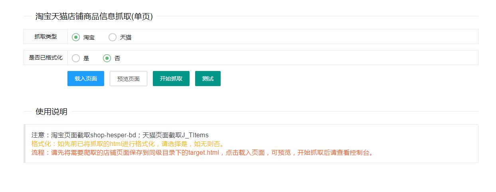

# catchProducts_htmlVer

JS爬取淘宝天猫店铺商品信息（页面版）

[catchProducts_TaobaoTmall](https://github.com/LCYBFF/catchProducts_TaobaoTmall)  的网页版
（OS：去年脑抽写出这么个绕圈子的网页版）
说明：先将需要爬取的目标html代码保存到target.html里，再在index.html里处理

